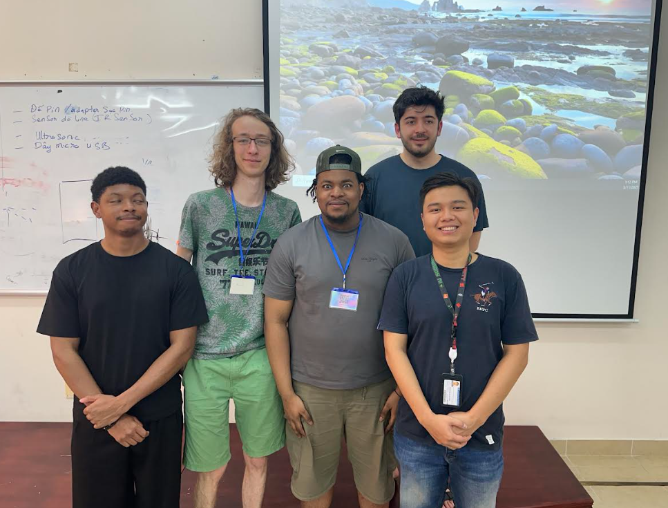

# IU-Computer-Vision-Rubiks

Project Overview
Our project involved designing and building an automated Rubik’s Cube solver robot in collaboration with Vietnamese students from Vietnam International University, Ho Chi Minh City. We combined Arduino programming with a Python-based color detection and solving algorithm to create a robot capable of automatically solving a Rubik’s Cube. The goal was for the robot to accurately identify cube colors, calculate the optimal solution, and physically execute all required moves independently.

Team Organization
The project tasks were clearly divided into two parts. Nathan and Patrice focused on programming the Arduino Nano and calibrating servo motors for precise mechanical movements, while Hassan and Renaud managed color detection and the solving algorithm using Python.

Arduino Programming and Servo Calibration (Nathan & Patrice)
Nathan and Patrice programmed an Arduino Nano to control eight servo motors. They carefully calibrated these servos, ensuring the robot could hold and rotate the Rubik’s Cube accurately. Their work included defining precise servo angles for each cube movement (front, up, left, right, etc.) and programming these into Arduino. Calibration was essential to guarantee reliable and smooth rotations, which directly impacted the success of the cube’s physical resolution.

Python Vision and Solving Algorithm (Hassan & Renaud)
Hassan and Renaud developed the Python application responsible for capturing the cube's colors through a camera. Using OpenCV, the program continuously captured images, accurately extracting color information from each of the cube’s 54 squares (9 squares per face). They matched these captured colors with predefined theoretical values to precisely determine the cube’s state. The Python code then applied the Kociemba algorithm, known for efficiently solving Rubik's Cubes, providing an optimized series of moves to reach the solution.

Final Integration
Finally, we integrated both parts of the project via serial communication between the Python program and Arduino Nano. Python sent calculated solving instructions directly to Arduino, which executed each move precisely through its servo motors. After several adjustments and optimizations, our robot successfully recognized the colors, computed the solution, and autonomously solved the cube in a reliable and efficient manner.